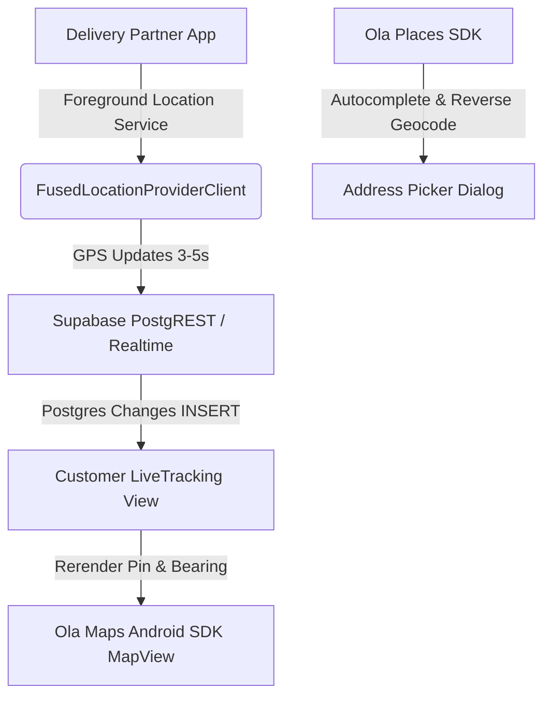

# GETORA - Ola Maps & Krutrim Maps Android SDK Integration Blueprint

This guide provides technical specifications, architectural patterns, and production-ready Kotlin code for integrating **Ola Maps / Krutrim Maps** into the GETORA Native Android Application.

---

## 1. Architectural Overview



GETORA uses:
- **Ola Maps Android SDK** for vector tile rendering (dark mode standard matching `#0A0F0D` and `#22C55E`).
- **Ola Maps Places & Routing REST / SDK** for location search, reverse geocoding, and polyline directions.
- **Supabase Realtime PostgreSQL channel** on `delivery_locations` for sub-second telemetry without battery drain.

---

## 2. Gradle Dependencies Setup

### Step 1: Add Ola Maps Maven Repository

In `settings.gradle.kts` (or project root `build.gradle.kts`):

```kotlin
dependencyResolutionManagement {
    repositoriesMode.set(RepositoriesMode.FAIL_ON_PROJECT_REPOS)
    repositories {
        google()
        mavenCentral()
        maven {
            url = uri("https://artifactory.olamaps.io/artifactory/olamaps-android-sdk/")
        }
    }
}
```

### Step 2: Add Dependencies in `app/build.gradle.kts`

```kotlin
dependencies {
    // Ola Maps Android SDK & Navigation
    implementation("io.olamaps.android:olamaps-android-sdk:1.0.0")

    // Google Play Services Location (for GPS capture)
    implementation("com.google.android.gms:play-services-location:21.2.0")

    // Supabase Realtime & Database (Kotlin Multiplatform)
    implementation(platform("io.github.jan-tennert.supabase:bom:2.4.0"))
    implementation("io.github.jan-tennert.supabase:postgrest-kt")
    implementation("io.github.jan-tennert.supabase:realtime-kt")

    // Jetpack Lifecycle & Coroutines
    implementation("androidx.lifecycle:lifecycle-viewmodel-ktx:2.7.0")
    implementation("org.jetbrains.kotlinx:kotlinx-coroutines-android:1.8.0")
}
```

---

## 3. AndroidManifest.xml Configuration

Add required location and network permissions:

```xml
<manifest xmlns:android="http://schemas.android.com/apk/res/android"
    package="com.getora.app">

    <!-- Location & Telemetry Permissions -->
    <uses-permission android:name="android.permission.INTERNET" />
    <uses-permission android:name="android.permission.ACCESS_NETWORK_STATE" />
    <uses-permission android:name="android.permission.ACCESS_FINE_LOCATION" />
    <uses-permission android:name="android.permission.ACCESS_COARSE_LOCATION" />
    <uses-permission android:name="android.permission.FOREGROUND_SERVICE" />
    <uses-permission android:name="android.permission.FOREGROUND_SERVICE_LOCATION" />

    <application
        android:name=".GetoraApplication"
        android:theme="@style/Theme.Getora">

        <!-- Ola Maps API Key Meta-data -->
        <meta-data
            android:name="io.olamaps.API_KEY"
            android:value="${OLA_MAPS_API_KEY}" />

        <!-- Background Rider Telemetry Service -->
        <service
            android:name=".services.RiderLocationTrackingService"
            android:foregroundServiceType="location"
            android:exported="false" />

    </application>
</manifest>
```

---

## 4. Initializing Ola Maps SDK

In `GetoraApplication.kt`:

```kotlin
package com.getora.app

import android.app.Application
import io.olamaps.android.OlaMaps

class GetoraApplication : Application() {
    override fun onCreate() {
        super.onCreate()
        
        // Initialize Ola Maps SDK with API Key
        val apiKey = BuildConfig.OLA_MAPS_API_KEY
        OlaMaps.initialize(
            context = this,
            apiKey = apiKey
        )
    }
}
```

---

## 5. Jetpack Compose / XML Map View Implementation

### Jetpack Compose Wrapper: `OlaMapView.kt`

```kotlin
package com.getora.app.ui.components

import androidx.compose.foundation.layout.fillMaxSize
import androidx.compose.runtime.*
import androidx.compose.ui.Modifier
import androidx.compose.ui.viewinterop.AndroidView
import io.olamaps.android.map.OlaMap
import io.olamaps.android.map.OlaMapView
import io.olamaps.android.map.model.LatLng
import io.olamaps.android.map.model.MarkerOptions

@Composable
fun GetoraOlaMap(
    centerLat: Double,
    centerLng: Double,
    zoomLevel: Double = 14.0,
    modifier: Modifier = Modifier,
    onMapReady: (OlaMap) -> Unit = {}
) {
    AndroidView(
        modifier = modifier.fillMaxSize(),
        factory = { context ->
            OlaMapView(context).apply {
                getMapAsync { map ->
                    // Apply GETORA dark mode standard
                    map.setStyleUrl("https://api.olamaps.io/tiles/vector/v1/styles/default-dark-standard/style.json")
                    map.animateCamera(LatLng(centerLat, centerLng), zoomLevel)
                    onMapReady(map)
                }
            }
        }
    )
}
```

---

## 6. Live Delivery Tracking with Supabase Realtime

When a customer opens the active order tracking screen in the Android app:

```kotlin
package com.getora.app.tracking

import androidx.lifecycle.ViewModel
import androidx.lifecycle.viewModelScope
import io.github.jan.supabase.SupabaseClient
import io.github.jan.supabase.realtime.channel
import io.github.jan.supabase.realtime.postgresChangeFlow
import io.github.jan.supabase.realtime.PostgresAction
import kotlinx.coroutines.flow.MutableStateFlow
import kotlinx.coroutines.flow.StateFlow
import kotlinx.coroutines.launch
import kotlinx.serialization.Serializable

@Serializable
data class DeliveryLocationUpdate(
    val order_id: String,
    val delivery_partner_id: String,
    val latitude: Double,
    val longitude: Double
)

class LiveOrderTrackingViewModel(
    private val supabase: SupabaseClient,
    private val orderId: String
) : ViewModel() {

    private val _riderLocation = MutableStateFlow<Pair<Double, Double>?>(null)
    val riderLocation: StateFlow<Pair<Double, Double>?> = _riderLocation

    init {
        subscribeToRiderLocation()
    }

    private fun subscribeToRiderLocation() {
        viewModelScope.launch {
            val trackingChannel = supabase.channel("tracking:$orderId")
            
            val changes = trackingChannel.postgresChangeFlow<PostgresAction.Insert>(schema = "public") {
                table = "delivery_locations"
                filter = "order_id=eq.$orderId"
            }

            trackingChannel.subscribe()

            changes.collect { insertAction ->
                val record = insertAction.decodeRecord<DeliveryLocationUpdate>()
                _riderLocation.value = Pair(record.latitude, record.longitude)
            }
        }
    }
}
```

---

## 7. Rider Telemetry Foreground Service (Delivery Partner App)

For the delivery partner's Android app, GPS coordinates are published to `delivery_locations` every 4 seconds while an order is active:

```kotlin
package com.getora.app.services

import android.app.NotificationChannel
import android.app.NotificationManager
import android.app.Service
import android.content.Intent
import android.os.IBinder
import android.os.Looper
import androidx.core.app.NotificationCompat
import com.google.android.gms.location.*
import io.github.jan.supabase.SupabaseClient
import io.github.jan.supabase.postgrest.postgrest
import kotlinx.coroutines.CoroutineScope
import kotlinx.coroutines.Dispatchers
import kotlinx.coroutines.launch

class RiderLocationTrackingService : Service() {
    private lateinit var fusedLocationClient: FusedLocationProviderClient
    private lateinit var locationCallback: LocationCallback
    private val scope = CoroutineScope(Dispatchers.IO)

    override fun onCreate() {
        super.onCreate()
        fusedLocationClient = LocationServices.getFusedLocationProviderClient(this)

        val locationRequest = LocationRequest.Builder(Priority.PRIORITY_HIGH_ACCURACY, 4000)
            .setMinUpdateIntervalMillis(2500)
            .build()

        locationCallback = object : LocationCallback() {
            override fun onLocationResult(result: LocationResult) {
                val loc = result.lastLocation ?: return
                // Broadcast to Supabase
                scope.launch {
                    try {
                        // supabase.from("delivery_locations").insert(...)
                    } catch (e: Exception) {
                        e.printStackTrace()
                    }
                }
            }
        }

        fusedLocationClient.requestLocationUpdates(locationRequest, locationCallback, Looper.getMainLooper())
    }

    override fun onBind(intent: Intent?): IBinder? = null
}
```

---

## 8. Summary of API Endpoints

| Purpose | Ola Maps REST Endpoint |
|---|---|
| **Autocomplete Places** | `GET https://api.olamaps.io/places/v1/autocomplete?input={query}&api_key={key}` |
| **Reverse Geocoding** | `GET https://api.olamaps.io/places/v1/reverse-geocode?latlng={lat},{lng}&api_key={key}` |
| **Routing / Directions** | `POST https://api.olamaps.io/routing/v1/directions?origin={lat,lng}&destination={lat,lng}&api_key={key}` |
| **Vector Tile Style (Dark)** | `https://api.olamaps.io/tiles/vector/v1/styles/default-dark-standard/style.json?api_key={key}` |
